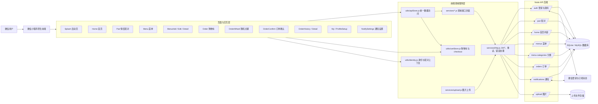
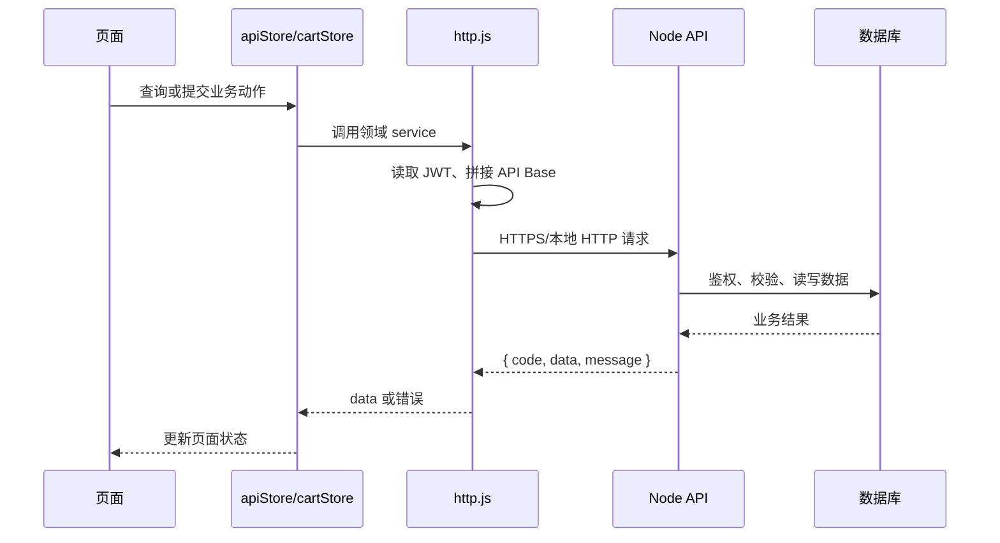
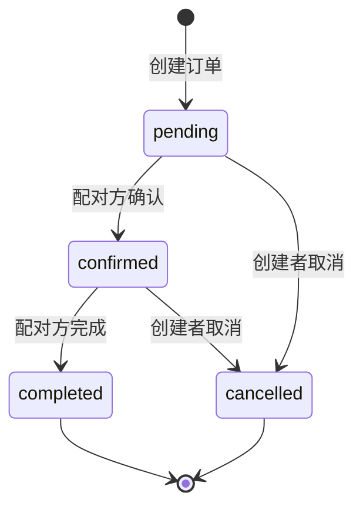

# Rainbow Cats 功能架构图

## 总体架构

## 核心数据流

## 订单状态与权限

权限规则：创建者可取消 `pending/confirmed` 订单；配对方可将 `pending` 确认、将 `confirmed` 完成；服务端负责最终鉴权。

## 分层职责

| 层 | 目录/组件 | 职责 |
| --- | --- | --- |
| 交互层 | `miniprogram/pages/` | 页面状态、用户输入、导航和提示 |
| 状态与聚合层 | `miniprogram/utils/apiStore.js` | 统一业务入口、作用域过滤、查询回退 |
| 本地状态层 | `miniprogram/utils/cartStore.js`、`identity.js` | 购物车、checkout、身份和配对上下文 |
| 接口层 | `miniprogram/services/*.js` | 将业务动作映射为 HTTP 请求 |
| 通信层 | `miniprogram/services/http.js` | API 地址、JWT、自动重登录、错误提示 |
| 后端路由层 | `../node-api/src/routes/` | 鉴权、参数校验、业务路由 |
| 持久化层 | Node API repository / DB | 用户、配对、菜单、订单、分类和通知数据 |
| 外部能力 | 微信 API、上传存储 | 登录、订阅消息、图片文件 |
