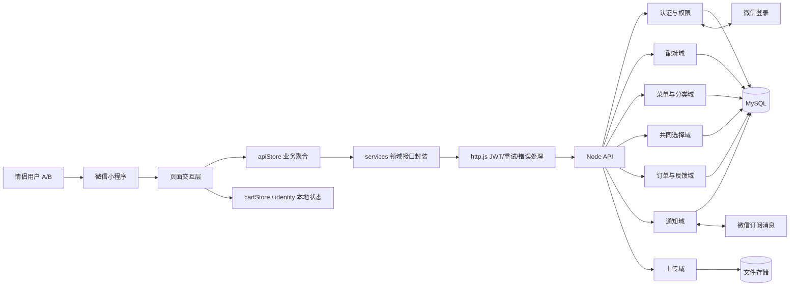
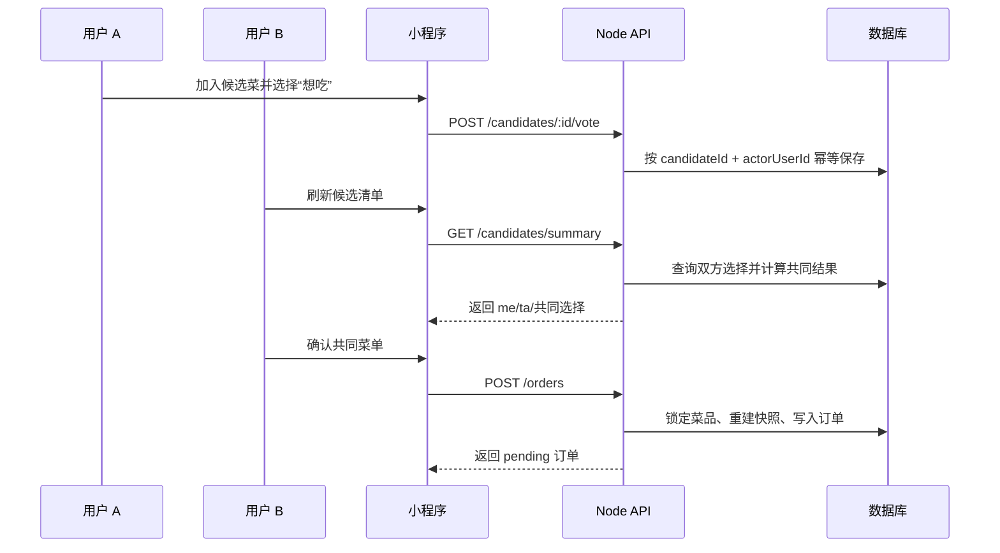

# Rainbow Cats 情侣协作增强需求文档

## 1. 文档目标

在现有“菜单、购物车、订单、配对”基础上，增强两个情侣共同决定吃什么的体验。需求以个人开发者可维护、微信小程序可实现、现有 Node API 架构可兼容为前提。

本文档是新增功能的需求契约，不替代当前功能文档。已实现功能继续以 `docs/功能文档.md` 和代码为准。

## 2. 产品目标

- 将“共享菜单”升级为“共同决策”。
- 降低情侣点餐时反复沟通和选择困难。
- 在不依赖支付、实时音视频或复杂社区的前提下，形成稳定的双人使用闭环。
- 所有前端展示状态都必须有后端或本地数据依据，不制造虚假的实时同步和成功状态。

## 3. 用户与使用场景

### 3.1 用户

- 两个已完成微信登录的用户，通过配对码建立关系。
- 未配对用户仍可使用单人菜单、购物车和订单功能。

### 3.2 核心场景

1. 两个人分别浏览菜单，表达“想吃/都可以/今天不想吃”。
2. 系统计算双方共同选择，减少决策成本。
3. 一方发起订单，另一方确认；双方都能看到订单状态和操作人。
4. 订单完成后记录本次用餐，并支持再次选择。

## 4. 微信与技术约束

- 使用原生微信小程序页面，不引入新的前端框架。
- 继续通过 `apiStore -> services -> http.js -> Node API` 访问后端。
- 使用 `wx.login`、小程序分享、订阅消息、相册/相机和本地存储等已有能力。
- 实时协作第一版使用页面进入刷新、下拉刷新和 15～30 秒轮询，不要求 WebSocket。
- 不依赖微信支付、后台无限推送、实时音视频、群聊或位置共享。
- 订阅消息必须由用户主动授权；拒绝授权不得阻断菜单和下单主流程。
- 生产接口和上传接口继续使用 HTTPS 合法域名。

## 5. 功能范围与优先级

### 5.1 P0：共同选择

#### 5.1.1 候选菜清单

- 菜单卡片增加“加入候选”动作。
- 候选状态与正式购物车分离。
- 候选记录属于当前配对关系；单人模式只属于当前用户。
- 候选清单展示菜品、创建者、当前可售状态和双方选择状态。
- 菜品下架或删除后，候选项保留历史状态，但不可直接进入订单。

#### 5.1.2 意愿表达

每个候选菜支持三种选择：

- `want`：我想吃。
- `neutral`：都可以。
- `avoid`：今天不想吃。

要求：

- 用户可以重复修改自己的选择。
- 不能修改伴侣的选择。
- 双方选择必须按用户独立保存，不能用单一字段覆盖。
- 前端显示“我/TA/共同选择”时，根据当前查看者动态派生角色。

#### 5.1.3 共同选择结果

系统按以下规则生成“默契菜单”：

1. 双方均为 `want`，优先级最高。
2. 一方 `want`，另一方 `neutral`，进入可接受列表。
3. 任一方为 `avoid`，不得进入共同推荐。
4. 无共同结果时，提供随机点餐和继续浏览入口。

共同选择可以一键加入正式购物车，但不能自动创建订单。

### 5.2 P0：订单协作状态

- 订单列表和详情明确显示创建者、当前查看者和伴侣角色。
- `pending`：创建者已发起，等待伴侣确认。
- `confirmed`：伴侣已确认，等待用餐完成。
- `completed`：订单完成，可由双方分别反馈。
- `cancelled`：创建者取消，终止后续操作。
- 状态更新必须由后端条件更新/版本校验保证并发下只有一个成功。
- 创建者只能取消 `pending/confirmed`。
- 伴侣只能确认 `pending`、完成 `confirmed`。
- 第三方或未配对用户不能查看或操作订单。

### 5.3 P1：同步与提醒

#### 5.3.1 站内同步

- 页面进入时刷新候选、订单和配对状态。
- 页面停留期间可按 15～30 秒轮询。
- 提供下拉刷新。
- 显示“刚刚同步”或最后同步时间。
- 网络失败时保留上一次数据，并提供重试入口。

#### 5.3.2 订阅消息

可申请的事件：

- 伴侣确认订单。
- 伴侣完成订单。
- 伴侣取消订单。
- 配对成功。

要求：

- 仅在用户主动授权且服务端模板可用时发送。
- 授权拒绝、模板缺失或发送失败不阻断业务。
- 服务端记录事件、接收人、模板、状态、错误和尝试次数。
- 相同事件使用幂等键，避免重复通知。

### 5.4 P1：偏好与忌口

- 用户可设置辣度、口味和饮食类型。
- 用户可维护不喜欢或过敏食材。
- 偏好默认仅本人可见；用户主动开启后才可同步给伴侣。
- 随机点餐和共同选择推荐时排除明确 `avoid` 或过敏冲突菜品。
- 下单前再次提示可能的忌口/过敏冲突。
- 不做热量、营养和医疗建议，避免超出个人开发者产品边界。

### 5.5 P1：收藏与想吃清单

区分四种状态：

- 收藏：长期喜欢。
- 想吃：近期计划。
- 候选：当前正在和伴侣讨论。
- 购物车：本次准备下单。

要求：

- 收藏和想吃状态按用户独立保存。
- 双方都收藏或都加入想吃的菜，标记为“共同心愿”。
- 历史订单支持“加入想吃清单”和“再次加入购物车”。

### 5.6 P2：用餐计划

- 支持按日期创建午餐/晚餐计划。
- 计划包含日期、餐次、菜品、备注和创建者。
- 支持双方查看和确认计划。
- 计划到期后转为历史记录，不自动创建订单。
- 可选配合订阅消息提醒，不承诺强制送达。

### 5.7 P2：情侣记录与轻量情绪反馈

- 配对成功、订单完成等关键节点提供简短反馈。
- 完成订单后可生成“今日一起吃饭”记录卡。
- 展示本周共同完成订单次数和常点菜品。
- 动效和文案必须服务于状态反馈，不能阻塞主流程。

## 6. 数据模型要求

### 6.1 candidate_items

- `id`
- `scopeKey`
- `menuId`
- `createdByUserId`
- `status`
- `createdAt`
- `updatedAt`

### 6.2 candidate_votes

- `candidateId`
- `actorUserId`
- `choice`
- `createdAt`
- `updatedAt`
- 唯一约束：`(candidateId, actorUserId)`

### 6.3 user_food_preferences

- `userId`
- `spiceLevel`
- `flavors`
- `dietType`
- `avoidIngredients`
- `allergyIngredients`
- `shareWithPartner`
- `updatedAt`

### 6.4 favorites / wish_list

- `userId`
- `menuId`
- `kind`：`favorite` 或 `wish`
- `createdAt`
- 唯一约束：`(userId, menuId, kind)`

### 6.5 meal_plans

- `id`
- `scopeKey`
- `date`
- `mealType`
- `menuId`
- `remark`
- `createdByUserId`
- `status`
- `createdAt`
- `updatedAt`

## 7. 接口要求

建议新增以下接口，命名与现有路由保持一致：

- `GET /api/candidates`
- `POST /api/candidates`
- `PATCH /api/candidates/:id`
- `DELETE /api/candidates/:id`
- `POST /api/candidates/:id/vote`
- `GET /api/candidates/summary`
- `GET /api/preferences`
- `PATCH /api/preferences`
- `GET /api/favorites`
- `POST /api/favorites`
- `DELETE /api/favorites/:menuId`
- `GET /api/wish-list`
- `POST /api/wish-list`
- `DELETE /api/wish-list/:menuId`
- `GET /api/meal-plans`
- `POST /api/meal-plans`
- `PATCH /api/meal-plans/:id`
- `DELETE /api/meal-plans/:id`

所有新增接口必须：

- 使用 JWT 鉴权。
- 根据当前用户和配对关系限制可见范围。
- 对写操作执行主体权限校验。
- 对重复请求提供幂等或唯一约束。
- 使用统一 `{ code, message, data }` 响应格式。

## 8. 前端页面要求

- 菜单页：增加候选入口、意愿按钮和共同选择提示。
- 首页：增加候选摘要、待确认订单和配对状态。
- 购物车页：区分候选菜与正式下单菜品，保持现有选择/删除逻辑。
- 订单确认页：展示双方头像、确认状态和通知授权结果。
- 订单历史/详情：展示相对角色、状态操作和双方独立反馈。
- 我的：增加偏好、忌口、收藏、想吃清单和用餐计划入口。
- 配对页：展示配对码有效期、状态和重新生成入口。

## 9. 非功能要求

- 下单、状态更新、反馈和配对绑定失败时，不得提示成功。
- 失败后保留用户可恢复的数据，例如购物车、候选和未提交计划。
- 所有列表接口返回 `list/total/page/pageSize/hasMore`。
- 个人信息、偏好和过敏数据遵循最小可见原则。
- 图片上传继续执行真实文件头、尺寸、像素和安全文件名校验。
- 新增功能需覆盖正常、边界、失败、并发和解绑后的访问矩阵。

## 10. 明确不纳入本阶段

- 微信支付、AA 账单和在线结算。
- 无限后台推送或类似 App 的常驻通知。
- 实时聊天、语音、视频和位置共享。
- 群组点餐、公开社区和陌生人社交。
- 热量计算、营养分析和医疗级过敏建议。
- 复杂推荐模型和需要长期训练的数据平台。

## 11. 验收标准

- 双方可以独立对同一候选菜表达选择，互不覆盖。
- 共同选择结果符合 `want/neutral/avoid` 规则。
- 候选菜、收藏、想吃、购物车四种状态互不混淆。
- 订单创建、确认、完成、取消的主体权限和并发冲突由后端强制执行。
- 下架/删除菜品不能被绕过进入订单；失败后购物车仍可恢复。
- 订阅消息拒绝、模板缺失或发送失败不影响核心下单流程。
- 解绑、换绑、重新配对后，历史数据和新数据的可见范围符合定义。
- 前端测试、后端契约测试和关键授权矩阵测试全部通过。

## 12. 功能架构设计



### 12.1 分层职责

| 层 | 组件 | 责任 |
| --- | --- | --- |
| 页面层 | `miniprogram/pages/*` | 展示状态、输入校验、导航、用户反馈 |
| 业务聚合层 | `miniprogram/utils/apiStore.js` | 统一调用入口、作用域过滤、领域错误映射 |
| 本地状态层 | `cartStore.js`、`identity.js` | 购物车、checkout、用户和配对上下文 |
| 接口封装层 | `miniprogram/services/*.js` | 请求路径、请求参数和响应数据封装 |
| 通信层 | `services/http.js` | API Base、JWT、自动重登录、错误处理 |
| API 路由层 | `node-api/src/routes/` | 鉴权、参数校验、HTTP 状态和错误码 |
| 数据访问层 | `node-api/src/data/db.js` | 事务、条件更新、快照、作用域查询 |
| 外部能力层 | 微信 API、文件存储 | 登录、订阅消息、图片保存 |

### 12.2 关键协作数据流



## 13. 后端数据库表设计

### 13.1 当前已实现表

| 表 | 关键字段 | 用途与约束 |
| --- | --- | --- |
| `users` | `id`、`wx_openid`、`nick_name`、`avatar_url`、`paired_with`、`paired_at`、`unpaired_at`、`pair_code`、`pair_code_expires_at`、`pair_code_status`、`notify_enabled` | 用户、配对关系、邀请码生命周期和个人通知开关；`wx_openid`、`username`、`pair_code` 建唯一约束 |
| `pair_state` | `id`、`is_paired`、`pair_code`、`last_bind_code`、`my_info_json`、`partner_info_json` | 兼容旧版配对状态，不作为新业务关系的唯一来源 |
| `banners` | `id`、`url`、`sort_order` | 首页轮播；写入仅管理员 |
| `menus` | `id`、`title`、`image`、`desc`、`category`、`category_label`、`available`、`owner`、`created_at` | 菜品及所有者；查询按配对范围，写入仅 owner |
| `menu_categories` | `scope_key`、`category_key`、`category_label`、`sort_order`、`created_at`、`updated_at` | 按单人/情侣作用域管理分类；`scope_key + category_key` 唯一 |
| `orders` | `id`、`status`、`creator_user_id`、`date`、`total_count`、`remark`、`idempotency_key`、`idempotency_hash`、`version` | 订单主表；幂等键唯一，`version` 用于并发 CAS |
| `order_items` | `order_id`、`menu_id`、`title`、`image`、`desc`、`count` | 订单菜品快照，不回读当前菜单名称和图片 |
| `order_timeline` | `order_id`、`status`、`label`、`time`、`actor_user_id`、`actor_name` | 订单状态事件和绝对操作人；前端按 viewer 派生角色 |
| `order_feedback` | `order_id`、`actor_user_id`、`liked`、`review`、`created_at`、`updated_at` | 双方独立评价；`order_id + actor_user_id` 唯一 |
| `app_config` | `config_key`、`config_value`、`updated_by`、`updated_at` | 全局配置，如通知模板 ID |
| `config_audit` | `config_key`、`old_value`、`new_value`、`actor_user_id`、`created_at` | 全局配置审计 |
| `uploaded_files` | `url`、`relative_path`、`folder`、`owner_user_id`、`status`、`bound_at`、`deleted_at` | 上传文件绑定、替换和过期清理 |
| `notification_deliveries` | `event_key`、`event_type`、`order_id`、`recipient_user_id`、`template_id`、`status`、`attempts`、`error_message`、`next_attempt_at` | 订阅消息投递记录；事件键唯一 |
| `sequences` | `name`、`value` | 菜单和订单编号序列 |

### 13.2 新增表设计（待扩展）

| 表 | 主键/唯一键 | 关键字段 | 说明 |
| --- | --- | --- | --- |
| `candidate_items` | `id`；建议唯一 `scope_key + menu_id` | `scope_key`、`menu_id`、`created_by_user_id`、`status`、`created_at`、`updated_at` | 候选菜清单；状态可为 `active/archived/unavailable` |
| `candidate_votes` | `id`；唯一 `candidate_id + actor_user_id` | `candidate_id`、`actor_user_id`、`choice`、`created_at`、`updated_at` | 双方独立意愿；`choice` 为 `want/neutral/avoid` |
| `user_food_preferences` | `user_id` | `spice_level`、`flavors_json`、`diet_type`、`avoid_json`、`allergy_json`、`share_with_partner`、`updated_at` | 个人偏好和忌口；默认最小可见 |
| `menu_user_marks` | 唯一 `user_id + menu_id + kind` | `user_id`、`menu_id`、`kind`、`created_at` | `kind` 为 `favorite/wish` |
| `meal_plans` | `id` | `scope_key`、`date`、`meal_type`、`menu_id`、`remark`、`created_by_user_id`、`status`、`created_at`、`updated_at` | 午餐/晚餐计划，不直接创建订单 |

新增表均需增加 `created_at/updated_at` 或等价时间字段，并通过 `scope_key` 或 `user_id` 实现单人、情侣和第三方隔离。

## 14. 字段设计与接口契约

### 14.1 通用字段规则

| 字段 | 类型 | 规则 |
| --- | --- | --- |
| `id` | `VARCHAR(64)` | 服务端生成，不接受客户端覆盖 |
| `userId` | `VARCHAR(64)` | JWT 当前用户身份；禁止使用客户端传入值决定权限 |
| `scopeKey` | `VARCHAR(191)` | 由服务端按用户/配对关系生成，客户端只用于展示上下文 |
| `createdAt/updatedAt` | `BIGINT` | Unix 毫秒时间戳，由服务端写入 |
| `status` | `VARCHAR(32)` | 使用领域枚举，未知状态前端按安全兜底展示 |
| `actorUserId` | `VARCHAR(64)` | 永久保存绝对操作人；`actorRole` 根据查看者动态派生 |

### 14.2 菜单字段

```json
{
  "_id": "m_123",
  "title": "番茄意面",
  "image": "https://example.com/menu.jpg",
  "desc": "酸甜开胃",
  "category": "main",
  "categoryLabel": "主食",
  "available": true,
  "owner": "u_xxx",
  "ownerName": "小猫",
  "ownerAvatar": "https://example.com/avatar.jpg",
  "createdAt": 1730000000000
}
```

客户端提交新增/编辑时只提交可编辑字段；`owner`、`createdAt` 和展示字段由服务端决定。

### 14.3 订单字段

```json
{
  "_id": "o_123",
  "status": "pending",
  "creatorUserId": "u_xxx",
  "creatorRole": "me",
  "version": 0,
  "date": 1730000000000,
  "remark": "少放辣",
  "idempotencyKey": "wx-1730000000000-ab12",
  "items": [
    { "menuId": "m_123", "title": "番茄意面", "image": "...", "desc": "...", "count": 2 }
  ],
  "timeline": [
    { "status": "pending", "label": "已下单", "actorUserId": "u_xxx", "actorRole": "me", "time": 1730000000000 }
  ],
  "feedbackList": [
    { "actorUserId": "u_xxx", "actorRole": "me", "liked": true, "review": "很好吃" }
  ]
}
```

订单创建请求只信任 `menuId/count/remark/idempotencyKey`；服务端按当前用户可见且可售的菜单重建 `items` 快照。

### 14.4 配对字段

```json
{
  "isPaired": true,
  "pairCode": "A1B2C3D4",
  "pairCodeCreatedAt": 1730000000000,
  "pairCodeExpiresAt": 1730086400000,
  "pairCodeStatus": "active",
  "myInfo": { "id": "u_a", "nickName": "我", "avatarUrl": "..." },
  "partnerInfo": { "id": "u_b", "nickName": "TA", "avatarUrl": "...", "pairedAt": 1730000000000 }
}
```

配对码状态：`active`、`used`、`expired`、`revoked`。绑定操作必须在事务内校验有效期、双方未配对和邀请码未使用。

### 14.5 共同选择字段（待扩展）

```json
{
  "id": "c_123",
  "menuId": "m_123",
  "status": "active",
  "votes": {
    "me": { "choice": "want", "updatedAt": 1730000000000 },
    "ta": { "choice": "neutral", "updatedAt": 1730000005000 }
  },
  "result": "recommended"
}
```

`result` 只能由服务端依据双方选择计算，前端不得自行写入共同结果。

## 15. 后续扩展设计原则

### 15.1 作用域模型

当前使用“用户/情侣”作用域。后续如扩展家庭、多人菜单或临时聚会，新增 `spaces` 和 `space_members` 抽象，现有 `scope_key` 作为兼容映射，不直接把 `paired_with` 扩展成多人字段。

### 15.2 接口版本与兼容

- 非破坏性变更优先新增字段，保留旧字段和旧错误码。
- 破坏性变更使用 `/api/v2`，旧客户端继续访问 `/api`。
- 列表接口保留 `list/total/page/pageSize/hasMore`，未来可增加 cursor。
- 所有响应建议携带 `requestId` 和 `updatedAt`，支持排查与增量同步。

### 15.3 领域事件

候选、订单、计划和配对动作预留统一事件：

- `pair.bound` / `pair.unbound`
- `candidate.updated`
- `order.created` / `order.status_changed`
- `meal_plan.reminded`

事件应先可靠写入 outbox 或等价记录，再由订阅消息、站内红点等消费者处理。业务接口不直接依赖某一种通知渠道。

### 15.4 功能开关与灰度

- 新功能通过服务端或本地功能开关控制。
- 开关维度支持版本、用户和配对关系。
- 关闭开关时，旧页面和旧接口仍可正常工作。
- 灰度功能必须有回滚开关，不以删除数据库字段回滚。

### 15.5 推荐规则可插拔

共同选择、随机点餐和偏好过滤实现为独立规则模块。

- 当前规则：`want/neutral/avoid`。
- 后续可增加口味、忌口、历史、时间和计划规则。
- 推荐结果应返回 `resultReason` 和 `ruleVersion`，支持解释和回溯。
- 第一阶段不引入机器学习服务，避免个人开发者运维和隐私负担。

### 15.6 数据生命周期

- 菜单、候选、收藏和计划允许软删除或状态归档。
- 订单、订单明细、时间线、反馈和审计记录不可因解绑直接删除。
- 解除关系后，新关系不能读取旧关系的私有候选、偏好和计划，历史订单按明确的可见性规则保留。
- 未来增加数据导出、注销和多设备时，继续以 `userId` 为稳定主键。
